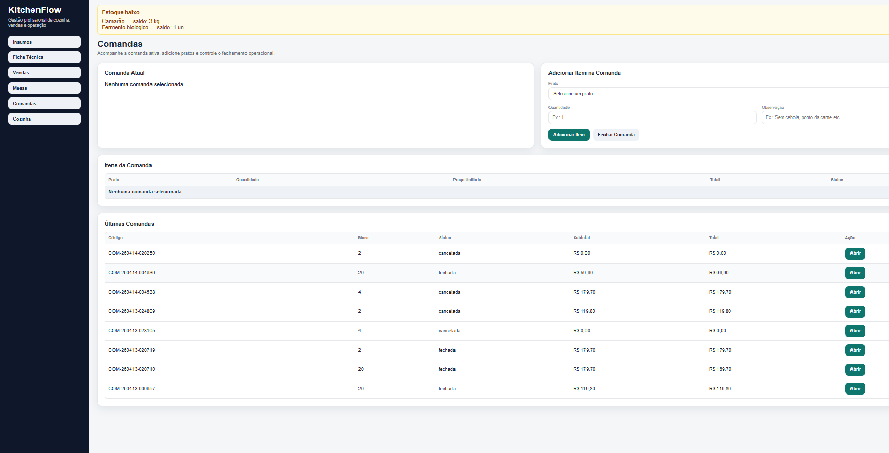

---

## 🌐 Sistema Online

O KitchenFlow V2 está disponível online para testes e demonstração:

🔗 https://kitchenflow-backend-p8cq.onrender.com

---

### ⚠️ Observação Técnica

O sistema utiliza banco de dados SQLite em ambiente temporário (`/tmp`), conforme padrão do Render.

Isso significa que:

- Os dados não são persistentes entre reinicializações do servidor
- O ambiente é ideal para demonstração e validação do sistema
- Para uso em produção, recomenda-se migração para banco persistente (PostgreSQL)

---

### 💡 Objetivo desta versão online

- Validar a arquitetura do sistema
- Demonstrar funcionamento real das rotas e regras de negócio
- Servir como portfólio técnico do projeto KitchenFlow V2

---
#  KitchenFlow V2 — Sistema de Gestão Gastronômica Inteligente

Sistema completo de gestão para restaurantes com foco em **controle operacional, precisão de custos e tomada de decisão estratégica**.

---

##  Interface do Sistema


---

##  Sobre o Projeto

O KitchenFlow V2 foi desenvolvido com base em **operações reais de cozinha profissional**, integrando:

- Gestão de pedidos
- Controle de custos (CMV real)
- Ficha técnica
- Inteligência de cardápio
- Análise de lucratividade

 Não é um CRUD simples. É um sistema orientado a regras de negócio.

---

##  Arquitetura

O sistema segue estrutura modular:

- **Controller:** entrada de requisições
- **Service:** regras de negócio
- **Data:** armazenamento (JSON)

Preparado para evolução para banco de dados (MongoDB).

---

##  Tecnologias

- Node.js
- Express.js
- JavaScript
- HTML / CSS
- DOM
- JSON

---

##  Funcionalidades

###  Operação
- Gestão de comandas
- Múltiplos pagamentos
- Cálculo automático de troco

###  Financeiro
- Faturamento total
- Ticket médio
- Lucro bruto

###  Inteligência
- CMV por prato
- Lucratividade
- Ranking de desempenho

--- 

##  Diferencial Técnico

O KitchenFlow V2 se destaca por aplicar conceitos de **engenharia de software voltados a problemas reais**, indo além de um sistema CRUD tradicional.

---
### 🧮 Cálculo de CMV REAL por prato

O sistema realiza o cálculo do custo real de cada prato com base na ficha técnica e nos insumos cadastrados:

```txt
Custo do prato = Σ (quantidade do insumo × custo unitário)
```


